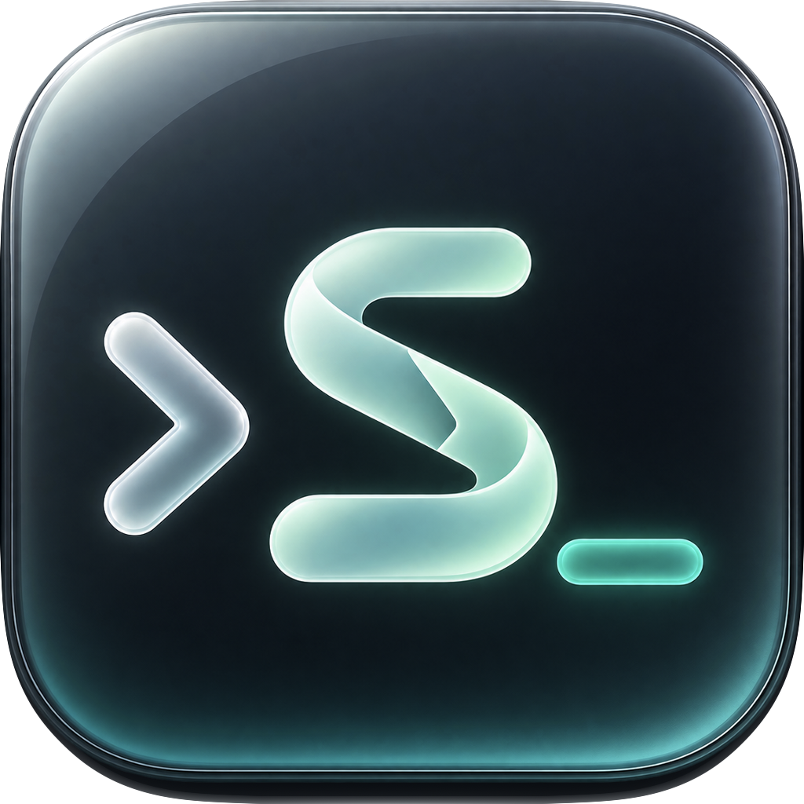

# SSHTree

原生 macOS 27 SSH 客户端。用侧边栏整理主机，在独立标签页中运行真实终端；连接资料可保存在本地、阿里云 OSS 或腾讯云 COS。



## 功能

- 中文首次启动引导，明确区分新建和打开已有资料库。
- 原生 SwiftUI 分栏、Liquid Glass 控件、独立设置窗口，跟随系统外观与辅助功能设置。
- 主机搜索、分组、编辑、备注与删除；单击选择、双击连接，支持同一主机的多个会话。
- SwiftTerm 1.20.0 + 系统 `/usr/bin/ssh` + 独立 PTY，支持系统 SSH 配置、密码和导入私钥。
- 实际服务器指纹确认、主机密钥变化拒绝连接、认证后连接状态、断线重连。
- AES-256-GCM 加密连接资料、SSH 密码、私钥及私钥口令。云访问密钥保存在本机钥匙串。
- 离线编辑、持久化上传队列、不可变修订、多设备合并与修改/删除冲突选择。
- 密码保护的备份导出、合并导入、从备份恢复到新的本地目录。

## 构建

需要 macOS 27、完整 Xcode 27 和 Metal Toolchain。首次构建需要网络下载锁定的 Swift Package 依赖。

```sh
export DEVELOPER_DIR=/Applications/Xcode.app/Contents/Developer
xcodebuild -version
xcodebuild -checkFirstLaunchStatus
# 若未安装 Metal Toolchain：
xcodebuild -downloadComponent MetalToolchain

./scripts/test.sh
./scripts/build-app.sh
```

也可打开 `SSHTree.xcodeproj`，选择 `SSHTree` scheme。命令行构建脚本信任锁定版本 SwiftTerm 的 BuildInfo 插件；首次在 Xcode 中构建时可检查并信任该插件。

产物为 `dist/SSHTree.app` 与 `release/SSHTree.dmg`，均被 Git 忽略。默认使用本机 ad-hoc 签名；面向公众分发时应使用自己的 Developer ID 签名并完成公证。

核心测试也可以运行：

```sh
DEVELOPER_DIR=/Applications/Xcode.app/Contents/Developer swift test
```

真实 loopback SSH 集成测试需指定刚构建的独立 helper；密码测试还需已有的 Python Paramiko 安装（可用 `SSHTREE_FIXTURE_PYTHON` 选择解释器）。测试自行创建临时服务器、密钥与 known_hosts，并在结束时清理：

```sh
DEVELOPER_DIR=/Applications/Xcode.app/Contents/Developer \
SSHTREE_ASKPASS_HELPER="$PWD/dist/SSHTree.app/Contents/MacOS/SSHTreeAskPass" \
swift test
```

原生测试产物默认放在 `~/Library/Developer/Xcode/DerivedData/SSHTreeTests`，避免测试运行器请求访问 Documents/Desktop。可用 `SSHTREE_TEST_DERIVED_DATA` 指定其他构建目录。

`swift run SSHTree` 便于开发界面，正式使用应运行 Xcode 构建的 `.app`，其中包含认证辅助程序、框架和原生图标。

## 配置存储

**Local：** 默认目录是 `~/Library/Application Support/SSHTree/Vault`，也可选择自定义目录。加密密钥随机生成并保存在这台 Mac 的钥匙串。迁移到新设备前，请在设置中导出密码保护的备份；单独复制本地加密文件无法替代密钥。

**OSS / COS：** 使用自己的私有 Bucket，填写地域、Bucket、访问密钥和对象前缀；COS Bucket 名称包含 APPID 后缀。OSS 地域填写 `cn-hangzhou` 等地域 ID，COS 填写 `ap-guangzhou` 等地域 ID。

创建云资料库时设置独立主密码。新设备使用同一个存储源、前缀、资料库 UUID 和主密码打开；也可先查询已有资料库。选择记住解锁信息后，主密码所需的解锁信息仅保存在本机钥匙串。

对象保存在 `<prefix>/v1/<vault UUID>/`。需要列举对象、读取对象、写入对象及查询 Bucket 版本控制状态的权限。使用未启用过版本控制的 Bucket；版本控制启用或暂停时，服务商的禁止覆盖语义无法满足资料库的写入要求，应用会拒绝写入。无需公共读取或删除对象权限。

编辑先原子保存到本地加密缓存，然后上传快照与提交。网络恢复、启动、回到前台和每 60 秒触发同步。列举所有分页并保留已知提交；同步过程中新增编辑会保留。冲突需要人工选择，源切换会保留原资料库与待上传队列。

主密码丢失无法从云端解密资料。错误密码、损坏文件、钥匙串缺失和不可访问的目录会进入解锁或修复页面，不会用空资料覆盖原文件。

## SSH 使用

系统认证模式遵循系统 OpenSSH 配置及 SSH Agent。密码和私钥模式使用所选连接资料；导入私钥只在认证期间写入权限为 `0600` 的临时文件，目录为 `0700`，认证成功、失败、取消、关闭或退出时清理。

密码不会写入启动参数、临时密码文件或日志。认证辅助程序通过受限 Unix socket 返回响应，未知提示由用户一次性输入。首次连接展示 OpenSSH 提供的实际指纹；主机密钥变更时按 OpenSSH 的严格校验拒绝连接。

常用快捷键：`⌘N` 添加主机、`⌘E` 编辑、`⌘↩` 连接、`⌘⇧W` 关闭当前终端、`⌘⇧R` 同步、`⌘,` 设置。打开设置和切换标签页会保留会话；关闭主窗口或退出时，活跃会话需要确认。

## 目录

```text
Sources/SSHTree/          SwiftUI 应用与终端桥接
Sources/SSHTreeCore/      加密、存储、同步、SSH 进程与认证 IPC
Sources/SSHTreeAskPass/   OpenSSH 认证辅助程序
Tests/SSHTreeCoreTests/   存储、同步、签名、PTY 与 IPC 回归测试
Resources/               Icon Composer 原生图标与第三方声明
SSHTree.xcodeproj/        原生工程与锁定的依赖
scripts/                 测试、构建与 DMG 打包
docs/                    架构与验证记录
```

应用标识为 `app.sshtree.mac`，应用配置位于 `~/Library/Application Support/SSHTree`。旧 Harbor 用户数据、钥匙串项目和系统 SSH 文件不会自动迁移或清理。

## 开源

[MIT 许可证](LICENSE)。SwiftTerm 及构建工具的许可证见 [ThirdPartyNotices.txt](Resources/ThirdPartyNotices.txt)。图标采用深色玻璃终端与流光 S，显示 `> S_`；Icon Composer 原生 `.icon` 包含选定的彩色图案和独立单色 SVG 轮廓，适配 Default、Dark 和 Mono 外观。生成与适配记录见 [IconDesign.json](Resources/IconDesign.json)。
